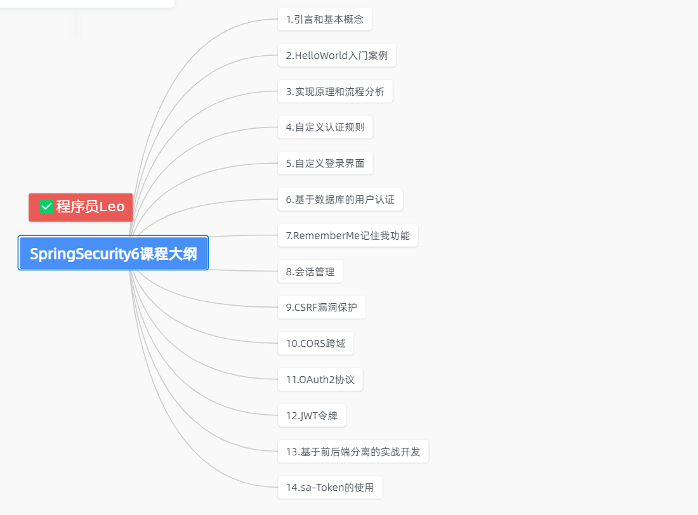

# 前言
跟着Leo从零开始学习SpringSecurity

## 目录大纲

1. 认识SpringSecurity
2. 认识SpringSecurity的核心组件
3. 认识SpringSecurity的认证方式
4. 认识SpringSecurity的授权方式
5. 认识SpringSecurity的过滤器
6. 认识SpringSecurity的配置
7. 认识SpringSecurity的异常处理
8. 认识SpringSecurity的自定义登录页面
9. 认识SpringSecurity的自定义登录处理
10. 认识SpringSecurity的退出登录处理
11. 认识SpringSecurity的注销登录处理
12. 认识SpringSecurity的记住我功能